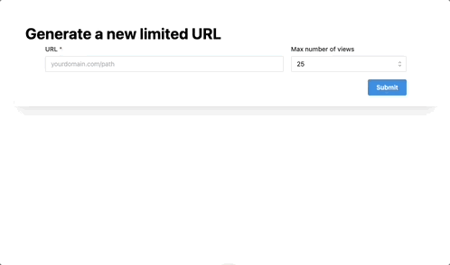
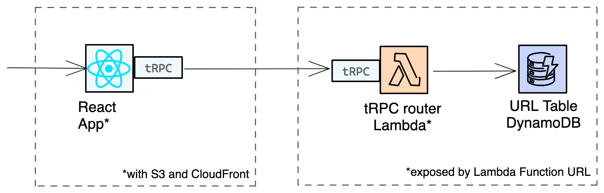

# limited-urls
A URL redirect service with a maximum number of users per link.

Try it [HERE](https://d2lwq4ke0bh45y.cloudfront.net/). 



Idea based on a tweet by [@mattpocockuk](https://twitter.com/mattpocockuk)


## Usage
1. Generate a link to a URL. Choose max number of views: 1, 10, 25 or 50.
2. In the overview page, copy public URL and share with your friends (or foes)
3. Your friend clicks the link. They are either
   1. Redirected to your specified URL **_or_**
   2. Stopped, if the max number of views has been reached

## Architecture overview

limited-urls is deployed to AWS using [the Serverless Stack](sst.dev).



# Stack
- A single page React app - 
  - uses construct [SST ReactStaticSite](https://docs.sst.dev/constructs/ReactStaticSite)
- A single Lambda function with public URL - 
  - uses [SST Function](https://docs.sst.dev/constructs/Function)
- A DynamoDB table to store and expire links - 
  - uses [SST Table](https://docs.sst.dev/constructs/Table)

## DynamoDB table

Our table looks as follows
```
{
  "id": "c1910355-cbd8-4f8e-b947-174bbfbf0207", // PK
  "updated_at": "2022-07-20T10:04:51.238Z",
  "remaining_forwards": 25,
  "created_at": "2022-07-20T10:04:51.238Z",
  "max_forwards": 25,
  "owner_client_id": "c8fadf25-cb99-453c-92a3-5b90f4acc166",
  "url": "https://wahlstrand.dev",
  "forwarded_client_ids": {}
}
```

## Todo
* [x] Allow URLs without protocol schema
* [x] Store URL (or token) in local storage and use that in request
* [x] Only allow overview for the admin
* [x] Style the redirect page
  * [x] During load
  * [x] When link has expired
* [x] Don't consume links for already redirected users
* [x] Create a test link for admin
* [x] Add screenshots or gif to documentation
* [x] Update Logo and title
* [x] Deploy to production
* [x] Update documentation
* [ ] Refactor React components
